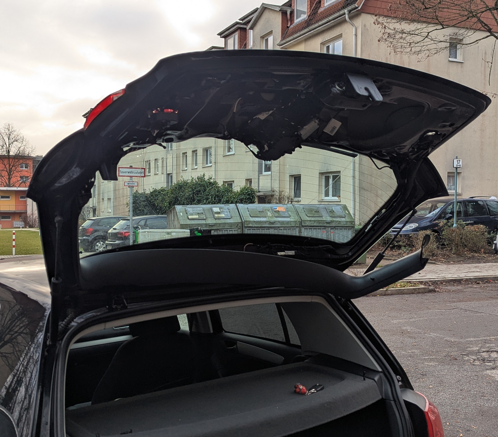
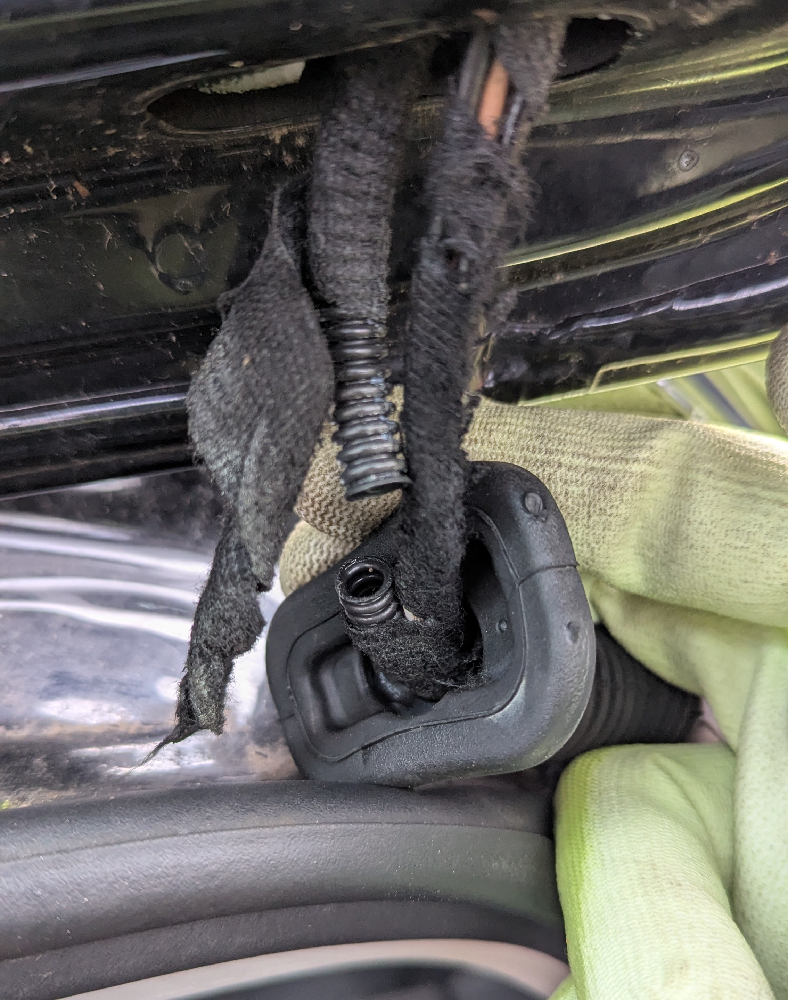
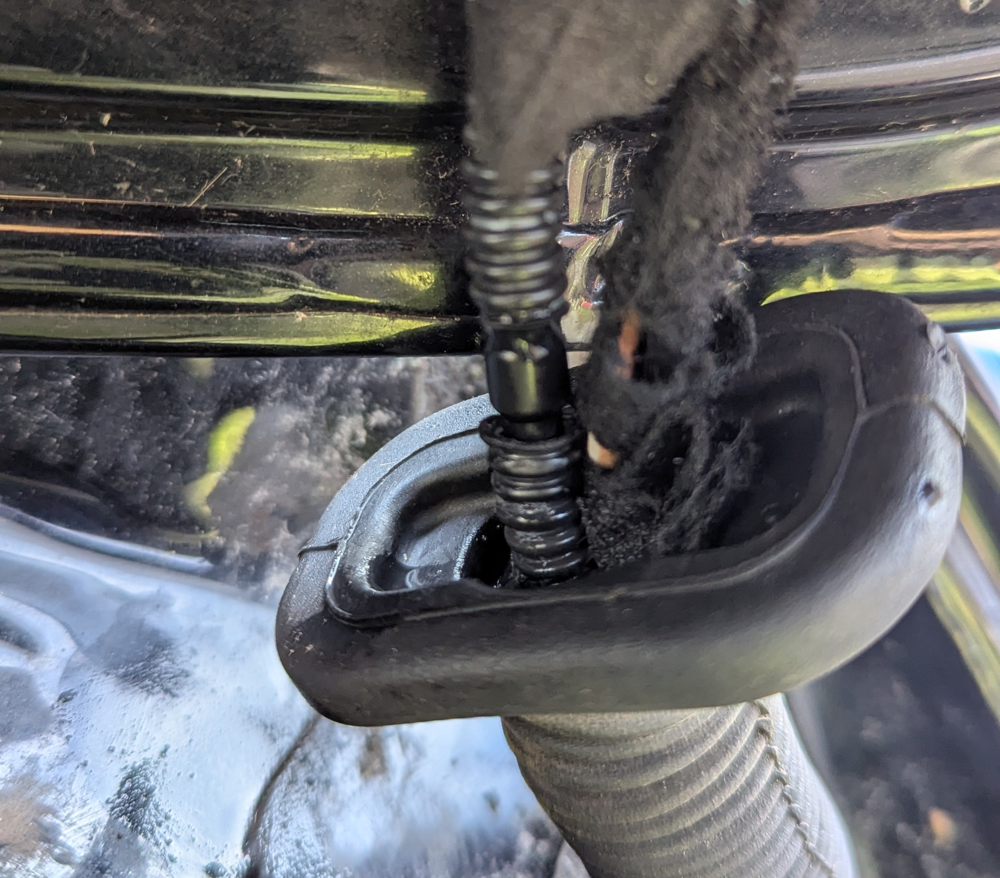
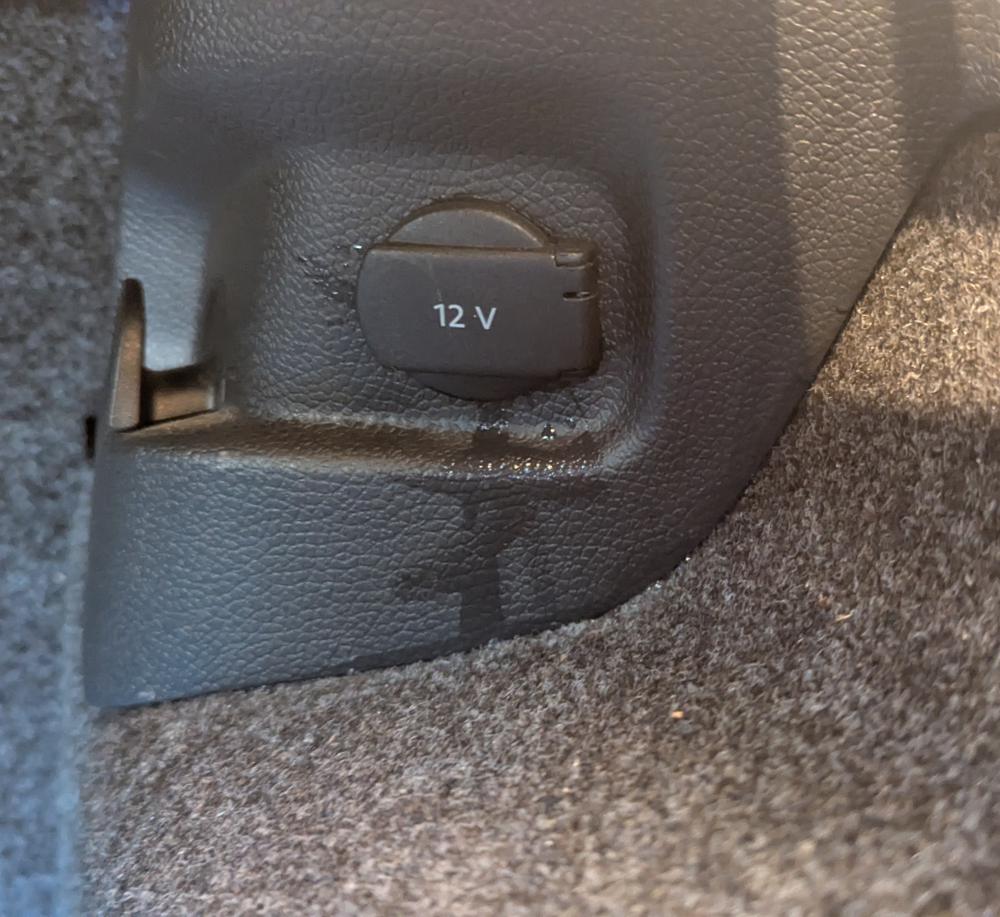

A few months the rear wiper started leaking a bit of wiper fluid inside my VW Golf 6. The problem got worse over time and now I end up with a buddle inside my car. I looked it up online and it seemed to be a common issue with this generation of VW vehicles. The hose is made of PVC, which tends to brake as these cars age. As I had a bit of time on my hand I decided to finally tackle this. First, I needed to localize where the leak it happening. For this, I needed to remove the panels on the tailgate. This is easily done by removing two torx screws (T20) and using force to pull the panels out.

In my case I didn't have any leaks behind the tailgate panels, but it was inside the rubber tube going from the car to the tailgate. I removed the wrapping and indeed the tube was broken.

I went online and order a tube connector from amazon (diameter = 4mm). These arrived on the next day (thank you, Jeff Bezos!) and I could continue my repair. For this I had to heat up the tube to make it soft enough for me to easily insert the connector. This ended up looking like this

While I managed to fix the leak at this spot, when I tested it I found that water was still not bring sprayed at the rear windshield (I recenlty learned that the correct term for it is "Backlight", but that sounds confusing). I inspected the car further and found the wiper fluid leaking from the 12V socket in the boot and on the rear wheel.

Well, I think this will require replacing the entire tube! I will just pretend that my car doesn't have a rear wiper fluid nozzle.